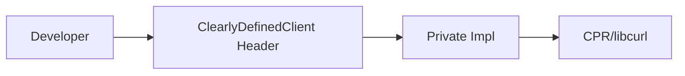

# license-discovery

A modern C++23 library and CLI tool designed to query the [ClearlyDefined](https://clearlydefined.io/) Definitions API for license and component metadata.

ClearlyDefined provides crowd-sourced, curated data for open source software components across various ecosystems.

## Status

[](https://github.com/Zheng-Bote/license-discovery/actions/workflows/ci.yml)
License: Apache-2.0

## Table of Contents

1. [Features](#features)
2. [Prerequisites](#prerequisites)
3. [Quick Start](#quick-start)
4. [CLI Usage](#cli-usage)
5. [Query Examples](#query-examples)
6. [Library API Reference](#library-api-reference)
7. [Architecture & Documentation](#architecture--documentation)
8. [Configuration](#configuration)
9. [Development](#development)
10. [Security](#security)

## Features

- **C++23 Standard**: Utilizes modern features like `std::expected`, `std::print`, and `std::ranges`.
- **Single & Batch Queries**: Query one or multiple coordinates in a single call.
- **Parallel Execution**: Batch queries are executed in parallel using `std::async` with configurable concurrency limits.
- **Resilience**: Exponential backoff with jitter for HTTP 429 (Rate Limit) and transient 5xx errors.
- **Rate Limiting**: Integrated client-side rate limiting to stay within API thresholds.
- **SPDX Normalization**: Normalizes license information where possible; returns `NOASSERTION` as a fallback.
- **Schema Validation**: Guarantees JSON output follows a consistent schema for both successes and errors.

## Prerequisites

- **Compiler**: C++23 compliant (GCC 13+, Clang 17+, or MSVC 2022 v17.x+)
- **Build Tools**: CMake 3.28+
- **Package Manager**: [Conan 2.0+](https://conan.io/)

## Quick Start

### Global C++23 Configuration

Ensure Conan is configured for C++23:

```bash
conan profile detect --force
sed -i 's/compiler.cppstd=.*/compiler.cppstd=23/' $(conan profile path default)
```

### Build with CMake + Conan

```bash
# Install dependencies
conan install . --output-folder=build --build=missing

# Configure and Build
cmake --preset conan-release
cmake --build --preset conan-release
```

## Integration via FetchContent

You can easily integrate `license-discovery` into your own CMake projects using `FetchContent`.

### Example `CMakeLists.txt`

```cmake
include(FetchContent)

FetchContent_Declare(
  license_discovery
  GIT_REPOSITORY https://github.com/Zheng-Bote/license-discovery.git
  GIT_TAG main # or a specific version tag
)

FetchContent_MakeAvailable(license_discovery)

# Now you can link against the library
add_executable(my_app main.cpp)
target_link_libraries(my_app PRIVATE license_discovery::license_discovery)
```

**Note**: Ensure your parent project is also configured for C++23 and has the necessary dependencies (`cpr`, `nlohmann_json`) available via Conan or your system's package manager.

## CLI Usage

The executable is located at `./build/build/Release/cdclient`.

```bash
./cdclient single --coord "git/github/curl/curl/7.88.1" --pretty
```

### Options

- `--base-url`: API endpoint (default: `https://api.clearlydefined.io`)
- `--github-token`: Token for higher rate limits (can also use `GITHUB_TOKEN` env var)
- `--concurrency`: Max parallel requests (default: 4)
- `--timeout`: Request timeout in ms (default: 30000)
- `--pretty`: Indented JSON output
- `--spdx-fallback`: Force "NOASSERTION" on unknown licenses

## Query Examples

### GitHub: curl

```bash
./cdclient single --coord "git/github/curl/curl/7.88.1" --pretty
```

### GitHub: nlohmann/json

```bash
./cdclient single --coord "git/github/nlohmann/json/v3.11.3" --pretty
```

### GitLab: Inkscape

```bash
./cdclient single --coord "git/gitlab/inkscape/inkscape/master" --pretty
```

### NPM: body-parser

```bash
./cdclient single --coord "npm/npmjs/-/body-parser/1.19.0" --pretty
```

### Batch Query from File

Create `coords.txt`:

```text
git/github/curl/curl/7.88.1
git/github/nlohmann/json/v3.11.3
npm/npmjs/-/body-parser/1.19.0
```

Run:

```bash
./cdclient batch --file coords.txt --concurrency 8 --pretty
```

## Library API Reference

### Initialization

```cpp
#include <license_discovery/clearly_defined_client.hpp>

using namespace license_discovery;

// Configure rate limits and retries
RateLimitConfig rl { .max_requests_per_second = 10 };
ClearlyDefinedClient client("https://api.clearlydefined.io", std::nullopt, 4, rl);

RetryPolicy rp { .max_attempts = 5, .base_delay = std::chrono::milliseconds(200) };
client.set_retry_policy(rp);
```

### Executing Queries

```cpp
// Single query (blocking)
nlohmann::json curl_data = client.query_single("git/github/curl/curl/7.88.1");

// Batch query (parallelized)
std::vector<std::string> coords = {"git/github/curl/curl/7.88.1", "git/gitlab/inkscape/inkscape/master"};
nlohmann::json results = client.query_batch(coords);
```

## Architecture & Documentation

### Overview

Detailed architecture documentation can be found in the `docs/architecture` directory:

- [Class Diagram](docs/architecture/class_diagram.mmd)
- [Sequence Diagram](docs/architecture/sequence_diagram.mmd)
- [Interfaces Overview](docs/architecture/interfaces.mmd)

The library follows a **Pimpl** (Private Implementation) pattern to keep the public headers clean and ensure binary compatibility.

### Design Pattern



## Configuration

| Option         | Description                  | Default                       |
| -------------- | ---------------------------- | ----------------------------- |
| Base URL       | ClearlyDefined endpoint      | https://api.clearlydefined.io |
| Concurrency    | Parallel requests in batch   | 4                             |
| Retry Attempts | Max retries on failure       | 3                             |
| Backoff Factor | Factor for exponential delay | 2.0                           |

## Development

### Running Tests

Unit tests use [Catch2 v3](https://github.com/catchorg/Catch2).

```bash
ctest --preset conan-release
```

### Coding Style

The project adheres to strict C++23 standards:

- `snake_case` for functions/variables.
- `PascalCase` for classes/structs.
- `std::print` for output (no `std::cout`).
- Doxygen style comments for all declarations.

## Security

- **Tokens**: Never hardcode GitHub tokens. Use the `GITHUB_TOKEN` environment variable or the CLI `--github-token` flag.
- **HTTPS**: TLS verification is enabled by default via `cpr`.

---

Author: **ZHENG Robert** (robert@hase-zheng.net)
Copyright (c) 2026 ZHENG Robert. Licensed under Apache-2.0.
