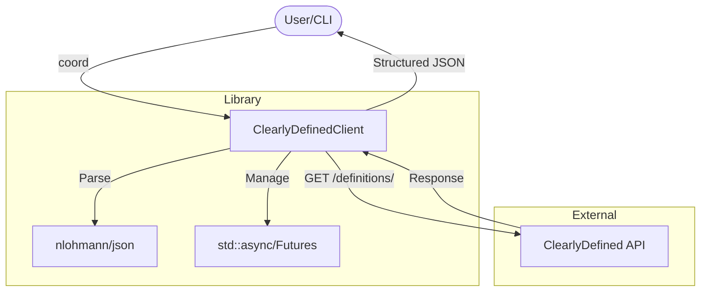
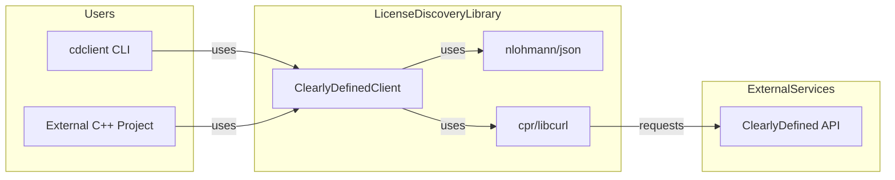
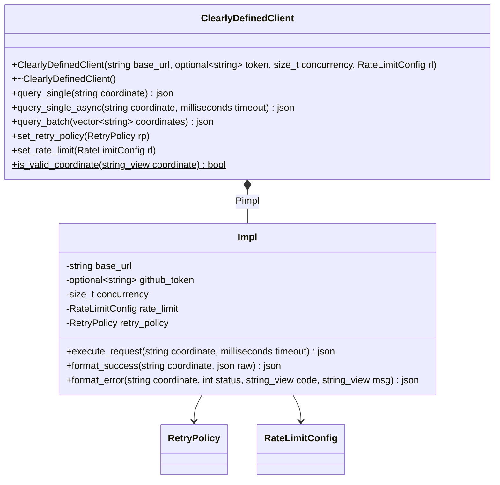
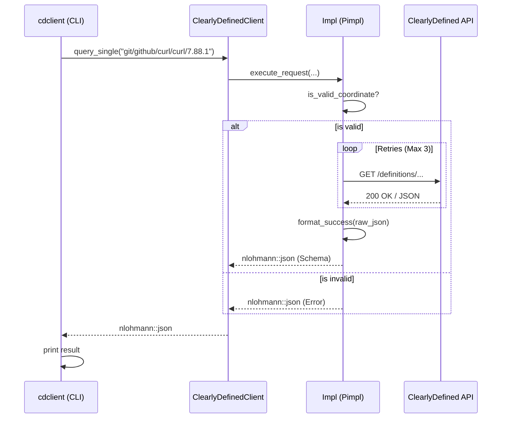

# Architecture Documentation - license-discovery

This document provides a detailed overview of the architectural design, components, and interactions within the `license-discovery` project.

## 1. Overview
The `license-discovery` project is a C++23 library and CLI tool designed to interface with the [ClearlyDefined](https://clearlydefined.io/) API. Its primary goal is to provide a reliable, performant, and easy-to-use interface for retrieving license metadata for software components.

### High-Level Architecture
The system is divided into a core library (`license_discovery`) and a CLI wrapper (`cdclient`).

## 2. Bounded Context & Interfaces
The library acts as a gateway to the ClearlyDefined ecosystem, abstracting the complexities of HTTP communication, retries, and data normalization.

## 3. Core Components

### ClearlyDefinedClient
The main entry point for the library. It uses the **Pimpl (Private Implementation)** pattern to:
- Hide implementation details (like `cpr` and `nlohmann_json` headers) from the user.
- Maintain a stable ABI.
- Reduce compilation times for consumers.

### Internal Implementation (`Impl`)
Handles the heavy lifting, including:
- **Coordinate Validation**: Ensures coordinates match the `type/provider/namespace/name/revision` pattern.
- **HTTP Communication**: Uses `cpr` for synchronous and asynchronous requests.
- **Resilience**: Implements exponential backoff with jitter for transient errors (429, 5xx).
- **Parallelism**: Uses `std::async` for batch queries, respecting a configurable concurrency limit.

## 4. Class Diagram
The following diagram illustrates the relationship between the public interface and the internal implementation.

## 5. Sequence Diagram: Single Query
This diagram shows the flow of a single coordinate query, including the internal retry loop.

## 6. Error Handling
The library uses a structured JSON approach for error handling, ensuring that consumers always receive a machine-readable response even when the API call fails.

Error fields:
- `status`: Contains HTTP status and error source.
- `error.code`: A semantic error code (e.g., `INVALID_COORDINATE`, `API_ERROR`).
- `error.message`: A human-readable description of the error.

## 7. Performance Considerations
- **Concurrency**: `query_batch` uses `std::async` with `std::launch::async` to utilize multiple cores.
- **Resource Management**: The Pimpl pattern ensures that heavy-weight objects (like HTTP session configurations) are managed within the implementation.
- **C++23 Features**: Extensive use of `std::string_view` to avoid unnecessary copies and `std::print` for high-performance logging/output in the CLI.

---
*Created by: ZHENG Robert*
*Date: 2026-04-08*
*Version: 0.1.0*
